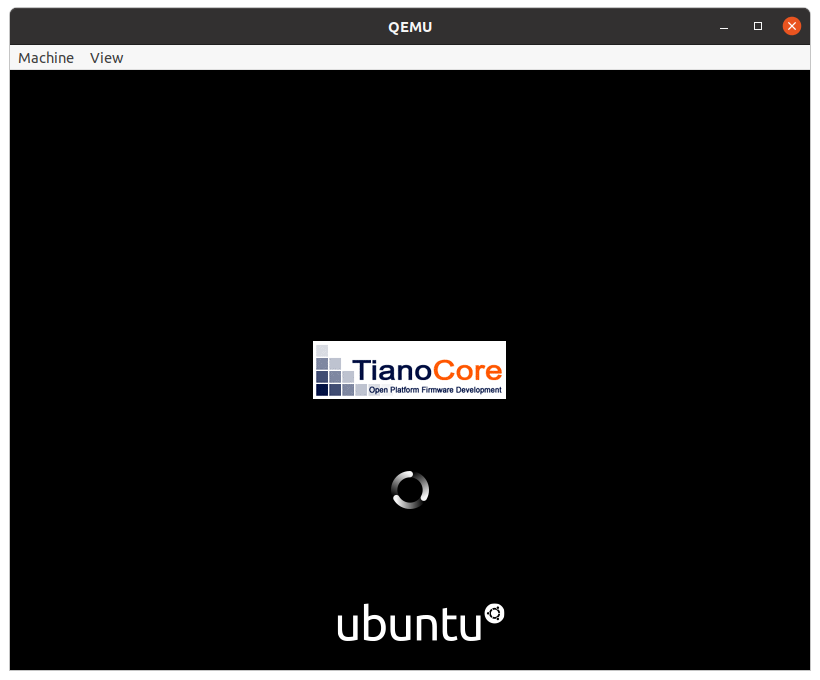

<div align="center">


# Quickemu

**Quickly create and run optimised Windows, macOS and Linux desktop virtual machines:**

</div>

```bash
quickget ubuntu-mate 22.04
quickemu --vm ubuntu-mate-22.04.conf
```

<div align="center">



**Made with 💝 for .**

Quickemu is available in the repositories of the following distros
(packaging status by [Repology.org](https://repology.org/)):

<table>
<tbody>
<tr valign="top">
<td>

[](https://repology.org/project/quickemu/versions)

</td>
<td>

[](https://repology.org/project/quickgui/versions)

</td>
</tr>
</tbody>
</table>

We have a Discord for this project:

[](https://discord.gg/sNmz3uw)

</div>

## Introduction

**Quickemu** is a wrapper for the excellent
[QEMU](https://www.qemu.org/) that attempts to automatically *"do the
right thing"*, rather than expose exhaustive configuration options. You
decide what operating system you want to run, and Quickemu will figure
out the best way to do it for you.

The original objective of the project was to enable [quick testing of
Linux distributions](#linux-guests) where the virtual machine
configurations can be stored anywhere (such as external USB storage or
your home directory) and no elevated permissions are required to run the
virtual machines. **Quickemu now also includes comprehensive support for
[macOS](#macos-guests) and [Windows](#windows-guests)**.

## Features

-   **macOS** Sonoma, Ventura, Monterey, Big Sur, Catalina, Mojave & High Sierra
-   **Windows** 10 and 11 including TPM 2.0
-   [Ubuntu](https://ubuntu.com/desktop) and all the **[official Ubuntu
    flavours](https://ubuntu.com/download/flavours)**
-   **Over 360 operating system editions are supported!**
-   Full SPICE support including host/guest clipboard sharing
-   VirtIO-webdavd file sharing for Linux and Windows guests
-   VirtIO-9p file sharing for Linux and macOS guests
-   [QEMU Guest Agent
    support](https://wiki.qemu.org/Features/GuestAgent); provides access
    to a system-level agent via standard QMP commands
-   Samba file sharing for Linux, macOS and Windows guests (*if `smbd`
    is installed on the host*)
-   VirGL acceleration
-   USB device pass-through
-   Smartcard pass-through
-   Automatic SSH port forwarding to guests
-   Network port forwarding
-   Full duplex audio
-   Braille support
-   EFI (with or without SecureBoot) and Legacy BIOS boot
-   Graphical user interfaces available

## Installation

### Arch Linux hosts

Quickemu is available from the AUR (Arch user repository), and can be
installed via any AUR helper. Assuming your AUR helper is yay, Run the
following command:

``` bash
yay -Sy quickemu
```
### Debian and derivatives

A [.deb package is available for Debian and derivatives in this project's GitHub releases page](https://github.com/quickemu-project/quickemu/releases).
Download the .deb and install it with `apt-get`.

```bash
sudo apt-get install ./quickemu_x.y.z-1_all.deb
```

### Ubuntu hosts

Quickemu is available from a PPA for Ubuntu users. The Quickemu PPA also
includes a back port of QEMU 6.0.0 for 20.04 (Focal) and 21.04
(Hirsute). To install Quickemu and all the dependencies run the
following in a terminal:

``` bash
sudo apt-add-repository ppa:flexiondotorg/quickemu
sudo apt update
sudo apt install quickemu
```

### NixOS hosts

To quickly try quickemu:

``` sh
nix-shell -p quickemu
```

To install via Nix profile:

``` sh
nix-env -iA pkgs.quickemu
```

To install via NixOS config:

``` nix
# /etc/nixos/configuration.nix
{pkgs, ...}: {
   environment.systemPackages = with pkgs;
     quickemu
   };
}
```

To install via Flakes:

``` sh
# TODO (flake users, please add an example!)
```

### Other Linux hosts (installing from source)

``` bash
git clone --filter=blob:none https://github.com/wimpysworld/quickemu
cd quickemu
```

When installing from source, you will need to install the following
requirements manually:

-   [QEMU](https://www.qemu.org/) (*6.0.0 or newer*) **with GTK, SDL,
    SPICE & VirtFS support**
-   [bash](https://www.gnu.org/software/bash/) (*4.0 or newer*)
-   [Coreutils](https://www.gnu.org/software/coreutils/)
-   [EDK II](https://github.com/tianocore/edk2)
-   [grep](https://www.gnu.org/software/grep/)
-   [jq](https://stedolan.github.io/jq/)
-   [LSB](https://wiki.linuxfoundation.org/lsb/start)
-   [procps](https://gitlab.com/procps-ng/procps)
-   [python3](https://www.python.org/)
-   [chunkcheck](https://gist.github.com/MCJack123/943eaca762730ca4b7ae460b731b68e7)
-   [mkisofs](http://cdrtools.sourceforge.net/private/cdrecord.html)
-   [usbutils](https://github.com/gregkh/usbutils)
-   [util-linux](https://github.com/karelzak/util-linux)
-   [sed](https://www.gnu.org/software/sed/)
-   [socat](http://www.dest-unreach.org/socat/)
-   [spicy](https://gitlab.freedesktop.org/spice/spice-gtk)
-   [swtpm](https://github.com/stefanberger/swtpm)
-   [Wget](https://www.gnu.org/software/wget/)
-   [xdg-user-dirs](https://www.freedesktop.org/wiki/Software/xdg-user-dirs/)
-   [xrandr](https://gitlab.freedesktop.org/xorg/app/xrandr)
-   [zsync](http://zsync.moria.org.uk/)
-   [unzip](http://www.info-zip.org/UnZip.html)

For Ubuntu, Arch and NixOS hosts, the
[ppa](https://launchpad.net/~flexiondotorg/+archive/ubuntu/quickemu),
[AUR](https://aur.archlinux.org/packages/quickemu) or
[nix](https://github.com/NixOS/nixpkgs/tree/master/pkgs/development/quickemu)
packaging will take care of the dependencies. For other host
distributions or operating systems it will be necessary to install the
above requirements or their equivalents.

These examples may save a little typing:

#### Install requirements on Debian hosts

This also applies to derivatives:

``` sh
sudo apt install qemu bash coreutils ovmf grep jq lsb-base procps python3 genisoimage usbutils util-linux sed spice-client-gtk libtss2-tcti-swtpm0 wget xdg-user-dirs zsync unzip
```

#### Install requirements on Fedora hosts

``` sh
sudo dnf install qemu bash coreutils edk2-tools grep jq lsb procps python3 genisoimage usbutils util-linux sed spice-gtk-tools swtpm wget xdg-user-dirs xrandr unzip
```

#### Install requirements on macOS hosts

This is a **work in progress** (see [issue 248](https://github.com/quickemu-project/quickemu/issues/248)
for other steps and changes that may enable running on MacOS)

``` sh
brew install qemu bash coreutils grep jq python@3.10 cdrtools gnu-sed spice-gtk wget zsync
```

## GUI (quickgui)

While `quickemu` and `quickget` are designed for the terminal, a
graphical user interface is also available:

-   **[Quickgui](https://github.com/quickgui/quickgui)** by [Mark
    Johnson](https://github.com/marxjohnson) and [Yannick
    Mauray](https://github.com/ymauray).

To install Quickgui on Ubuntu:

``` sh
sudo add-apt-repository ppa:yannick-mauray/quickgui
sudo apt update
sudo apt install quickgui
```

Many thanks to [Luke Wesley-Holley](https://github.com/Lukewh) and
[Philipp Kiemle](https://github.com/daPhipz) for creating the
**[Quickemu icons](https://github.com/Lukewh/quickemu-icons)** 🎨

## TUI (qqx)

From Nov 2023, there is also a multi option desktop integrated text
interface, the **quickemu quickget X terminal project**, a.k.a. **qqX**,
with lots of unique tools and utilities to help you make light work of
installations, snapshots and disk management

-   **[qqX](https://github.com/TuxVinyards/qqX)** is independently
    curated by [Alex Genovese](https://github.com/TuxVinyards) (see the
    github pages)


## Creating Linux guests 🐧

### Ubuntu

`quickget` will automatically download an Ubuntu release and create the
virtual machine configuration.

``` bash
quickget ubuntu 22.04
quickemu --vm ubuntu-22.04.conf
```

-   Complete the installation as normal.
-   Post-install:
    -   Install the SPICE agent (`spice-vdagent`) in the guest to enable
        copy/paste and USB redirection
        -   `sudo apt install spice-vdagent`
    -   Install the SPICE WebDAV agent (`spice-webdavd`) in the guest to
        enable file sharing.
        -   `sudo apt install spice-webdavd`

### Ubuntu daily-live images

`quickget` can also download/refresh daily-live images via `zsync` for Ubuntu developers and testers.

``` bash
quickget ubuntu daily-live
quickemu --vm ubuntu-daily-live.conf
```

You can run `quickget ubuntu daily-live` to refresh your daily development
image as often as you like, it will even automatically switch to a new
series.

### Ubuntu Flavours

All the official Ubuntu flavours are supported, just replace `ubuntu`
with your preferred flavour.

-   `edubuntu` (Edubuntu)
-   `kubuntu` (Kubuntu)
-   `lubuntu` (Lubuntu)
-   `ubuntu-budgie` (Ubuntu Budgie)
-   `ubuntucinnamon` (Ubuntu Cinnamon)
-   `ubuntukylin` (Ubuntu Kylin)
-   `ubuntu-mate` (Ubuntu MATE)
-   `ubuntu-server` (Ubuntu Server)
-   `ubuntustudio` (Ubuntu Studio)
-   `ubuntu` (Ubuntu)
-   `ubuntu-unity` (Ubuntu Unity)
-   `xubuntu` (Xubuntu)

You can also use `quickget` with options to:

``` shell
    # show an OS ISO download URL for {os} {release} [edition]
    quickget --show-iso-url fedora 38 Silverblue
    # test if an OS ISO is available for {os} {release} [edition]
    quickget --test-iso-url nixos 23.05 plasma5
    # open an OS distribution homepage in a browser
    quickget --open-distro-homepage  ubuntu-mate
    # Only download image file into current directory, without creating VM
    quickget --download-iso elementary 7.1
```

The `--show-iso-url`, `--test-iso-url`, and `--download-iso` options are
fully functional for all operating systems, including Windows and macOS.

### Other Operating Systems

`quickget` also supports:

-   `alma` (Alma Linux)
-   `alpine` (Alpine Linux)
-   `android` (Android x86)
-   `antix` (Antix)
-   `archcraft` (Archcraft)
-   `archlinux` (Arch Linux)
-   `arcolinux` (Arco Linux)
-   `artixlinux` (Artix Linux)
-   `athenaos` (Athenaos)
-   `batocera` (Batocera)
-   `bazzite` (Bazzite)
-   `biglinux` (BigLinux)
-   `blendos` (BlendOS)
-   `bodhi` (Bodhi)
-   `bunsenlabs` (Bunsenlabs)
-   `cachyos` (CachyOS)
-   `centos-stream` (CentOS Stream)
-   `chimeralinux` (Chimera Linux)
-   `crunchbang++` (Crunchbang++)
-   `debian` (Debian)
-   `deepin` (Deepin)
-   `devuan` (Devuan)
-   `dragonflybsd` (DragonFlyBSD)
-   `easyos` (EasyOS)
-   `elementary` (elementary OS)
-   `endeavouros` (EndeavourOS)
-   `endless` (Endless OS)
-   `fedora` (Fedora)
-   `freebsd` (FreeBSD)
-   `freedos` (FreeDOS)
-   `garuda` (Garuda Linux)
-   `gentoo` (Gentoo)
-   `ghostbsd` (GhostBSD)
-   `gnomeos` (GNOME OS)
-   `guix` (Guix)
-   `haiku` (Haiku)
-   `kali` (Kali)
-   `kdeneon` (KDE Neon)
-   `kolibrios` (KolibriOS)
-   `linuxlite` (Linux Lite)
-   `linuxmint` (Linux Mint)
-   `lmde` (Linux Mint Debian Edition)
-   `mageia` (Mageia)
-   `manjaro` (Manjaro)
-   `mxlinux` (MX Linux)
-   `netboot` (netboot.xyz)
-   `netbsd` (NetBSD)
-   `nitrux` (Nitrux)
-   `nixos` (NixOS)
-   `openbsd` (OpenBSD)
-   `openindiana` (OpenIndiana)
-   `opensuse` (openSUSE)
-   `oraclelinux` (Oracle Linux)
-   `parrotsec` (Parrot Security)
-   `peppermint` (PeppermintOS)
-   `popos` (Pop!\_OS)
-   `porteus` (Porteus)
-   `primtux` (Primtux)
-   `reactos` (ReactOS)
-   `rebornos` (RebornOS)
-   `rockylinux` (Rocky Linux)
-   `siduction` (Siduction)
-   `slackware` (Slackware)
-   `slax` (Slax)
-   `slint` (Slint)
-   `slitaz` (SliTaz GNU/Linux)
-   `solus` (Solus)
-   `spirallinux` (Spirallinux)
-   `tails` (Tails)
-   `tinycore` (Tiny Core Linux)
-   `trisquel` (Trisquel)
-   `truenas-core` (TrueNAS Core)
-   `truenas-scale` (TrueNAS Scale)
-   `vanillaos` (Vanilla OS)
-   `void` (Void Linux)
-   `vxlinux` (VX Linux)
-   `xerolinux` (XeroLinux)
-   `zorin` (Zorin OS)

### Custom Linux guests

Or you can download a Linux image and manually create a VM
configuration.

-   Download a .iso image of a Linux distribution
-   Create a VM configuration file; for example `debian-bullseye.conf`

``` bash
guest_os="linux"
disk_img="debian-bullseye/disk.qcow2"
iso="debian-bullseye/firmware-11.0.0-amd64-DVD-1.iso"
```

-   Use `quickemu` to start the virtual machine:

``` bash
quickemu --vm debian-bullseye.conf
```

-   Complete the installation as normal.
-   Post-install:
    -   Install the SPICE agent (`spice-vdagent`) in the guest to enable
        copy/paste and USB redirection.
    -   Install the SPICE WebDAV agent (`spice-webdavd`) in the guest to
        enable file sharing.

## Creating macOS Guests 🍏

`quickget` automatically downloads a macOS recovery image and creates a
virtual machine configuration.

``` bash
quickget macos catalina
quickemu --vm macos-catalina.conf
```

macOS `high-sierra`, `mojave`, `catalina`, `big-sur`, `monterey`,
`ventura` and `sonoma` are supported.

-   Use cursor keys and enter key to select the **macOS Base System**
-   From **macOS Utilities**
    -   Click **Disk Utility** and **Continue**
        -   Select `QEMU HARDDISK Media` (\~103.08GB) from the list (on
            Big Sur and above use `Apple Inc. VirtIO Block Device`) and
            click **Erase**.
        -   Enter a `Name:` for the disk
        -   If you are installing macOS Mojave or later (Catalina, Big
            Sur, Monterey, Ventura and Sonoma), choose any of the APFS
            options as the filesystem. MacOS Extended may not work.
    -   Click **Erase**.
    -   Click **Done**.
    -   Close Disk Utility
-   From **macOS Utilities**
    -   Click **Reinstall macOS** and **Continue**
-   Complete the installation as you normally would.
    -   On the first reboot use cursor keys and enter key to select
        **macOS Installer**
    -   On the subsequent reboots use cursor keys and enter key to
        select the disk you named
-   Once you have finished installing macOS you will be presented with
    an the out-of-the-box first-start wizard to configure various
    options and set up your username and password
-   OPTIONAL: After you have concluded the out-of-the-box wizard, you
    may want to enable the TRIM feature that the computer industry
    created for SSD disks. This feature in our macOS installation will
    allow QuickEmu to compact (shrink) your macOS disk image whenever
    you delete files inside the Virtual Machine. Without this step your
    macOS disk image will only ever get larger and will not shrink even
    when you delete lots of data inside macOS.
    -   To enable TRIM, open the Terminal application and type the
        following command followed by pressing command on the hard disk
        when files are deleted:

``` bash
sudo trimforce enable
```

You will be prompted to enter your account's password to gain the
privilege needed. Once you've entered your password and pressed in the
form of two questions that require you to type response as though you
said "no":

``` plain
IMPORTANT NOTICE: This tool force-enables TRIM for all relevant attached devices, even though such devices may not have been validated for data integrity while using TRIM. Use of this tool to enable TRIM may result in unintended data loss or data corruption. It should not be used in a commercial operating environment or with important data. Before using this tool, you should back up all of your data and regularly back up data while TRIM is enabled. This tool is provided on an "as is" basis. APPLE MAKES NO WARRANTIES, EXPRESS OR IMPLIED, INCLUDING WITHOUT LIMITATION THE IMPLIED WARRANTIES OF NON-INFRINGEMENT, MERCHANTABILITY AND FITNESS FOR A PARTICULAR PURPOSE, REGARDING THIS TOOL OR ITS USE ALONE OR IN COMBINATION WITH YOUR DEVICES, SYSTEMS, OR SERVICES. BY USING THIS TOOL TO ENABLE TRIM, YOU AGREE THAT, TO THE EXTENT PERMITTED BY APPLICABLE LAW, USE OF THE TOOL IS AT YOUR SOLE RISK AND THAT THE ENTIRE RISK AS TO SATISFACTORY QUALITY, PERFORMANCE, ACCURACY AND EFFORT IS WITH YOU.
Are you sure you with to proceed (y/N)?
```

And a second confirmation once you've confirmed the previous one:

``` plain
Your system will immediately reboot when this is complete.
Is this OK (y/N)?
```

As the last message states, your system will automatically reboot as
soon as the command completes.

The default macOS configuration looks like this:

``` bash
guest_os="macos"
img="macos-catalina/RecoveryImage.img"
disk_img="macos-catalina/disk.qcow2"
macos_release="catalina"
```

-   `guest_os="macos"` instructs Quickemu to optimise for macOS.
-   `macos_release="catalina"` instructs Quickemu to optimise for a
    particular macOS release.
    -   For example VirtIO Network and Memory Ballooning are available
        in Big Sur and newer, but not previous releases.
    -   And VirtIO Block Media (disks) are supported/stable in Catalina
        and newer.

### macOS compatibility

There are some considerations when running macOS via Quickemu.

-   Supported macOS releases:
    -   High Sierra
    -   Mojave
    -   Catalina **(Recommended)**
    -   Big Sur
    -   Monterey
    -   Ventura
    -   Sonoma
-   `quickemu` will automatically download the required
    [OpenCore](https://github.com/acidanthera/OpenCorePkg) bootloader
    and OVMF firmware from [OSX-KVM](https://github.com/kholia/OSX-KVM).
-   Optimised by default, but no GPU acceleration is available.
    -   Host CPU vendor is detected and guest CPU is optimised
        accordingly.
    -   [VirtIO Block
        Media](https://www.kraxel.org/blog/2019/06/macos-qemu-guest/) is
        used for the system disk where supported.
    -   [VirtIO `usb-tablet`](http://philjordan.eu/osx-virt/) is used
        for the mouse.
    -   VirtIO Network (`virtio-net`) is supported and enabled on macOS
        Big Sur and newer but previous releases use `vmxnet3`.
    -   VirtIO Memory Ballooning is supported and enabled on macOS Big
        Sur and newer but disabled for other support macOS releases.
-   USB host and SPICE pass-through is:
    -   UHCI (USB 2.0) on macOS Catalina and earlier.
    -   XHCI (USB 3.0) on macOS Big Sur and newer.
-   Display resolution can only be changed via macOS System Preferences.
-   **Full Duplex audio requires [VoodooHDA
    OC](https://github.com/chris1111/VoodooHDA-OC) or pass-through a USB
    audio-device to the macOS guest VM**.
-   NOTE! [Gatekeeper](https://disable-gatekeeper.github.io/) and
    [System Integrity Protection
    (SIP)](https://developer.apple.com/documentation/security/disabling_and_enabling_system_integrity_protection)
    need to be disabled to install VoodooHDA OC
-   File sharing between guest and host is available via
    [virtio-9p](https://wiki.qemu.org/Documentation/9psetup) and [SPICE
    webdavd](https://gitlab.gnome.org/GNOME/phodav/-/merge_requests/24).
-   Copy/paste via SPICE agent is **not available on macOS**.

### macOS App Store

If you see *"Your device or computer could not be verified"* when you
try to login to the App Store, make sure that your wired ethernet device
is `en0`. Use `ifconfig` in a terminal to verify this.

If the wired ethernet device is not `en0`, then then go to *System
Preferences* -\> *Network*, delete all the network devices and apply the
changes. Next, open a terminal and run the following:

``` bash
sudo rm /Library/Preferences/SystemConfiguration/NetworkInterfaces.plist
```

Now reboot, and the App Store should work.

## Creating Windows guests 🪟

`quickget` can download [**Windows
10**](https://www.microsoft.com/software-download/windows10) and
[**Windows 11**](https://www.microsoft.com/software-download/windows11)
automatically and create an optimised virtual machine configuration.
This configuration also includes the [VirtIO drivers for
Windows](https://fedorapeople.org/groups/virt/virtio-win/direct-downloads/).

**Windows 8.1** is also supported but doesn't feature any automated
installation or driver optimisation.

`quickget` can also download [Windows 10
LTSC](https://www.microsoft.com/en-us/evalcenter/download-windows-10-enterprise)
and Windows Server
[2012-r2](https://www.microsoft.com/en-us/evalcenter/download-windows-server-2012-r2),
[2016](https://www.microsoft.com/en-us/evalcenter/download-windows-server-2016),
[2019](https://www.microsoft.com/en-us/evalcenter/download-windows-server-2019),
and
[2022](https://www.microsoft.com/en-us/evalcenter/download-windows-server-2022).
No automated installation is supported for these releases.

``` bash
quickget windows 11
quickemu --vm windows-11.conf
```

-   Complete the installation as you normally would.
-   All relevant drivers and services should be installed automatically.
-   A local administrator user account is automatically created, with
    these credentials:
    -   Username: `Quickemu`
    -   Password: `quickemu`

### Regional versions

By default `quickget` will download the *"English International"*
release (*"English (United States)"* for server releases), but you can
optionally specify one of the supported languages: For example:

``` bash
quickget windows 11 "Chinese (Traditional)"
```

The default Windows 11 configuration looks like this:

``` bash
guest_os="windows"
disk_img="windows-11/disk.qcow2"
iso="windows-11/windows-11.iso"
fixed_iso="windows-11/virtio-win.iso"
tpm="on"
secureboot="off"
```

-   `guest_os="windows"` instructs `quickemu` to optimise for Windows.
-   `fixed_iso=` specifies the ISO image that provides VirtIO drivers.
-   `tpm="on"` instructs `quickemu` to create a software emulated TPM
    device using `swtpm`.

## Connecting to your VM

### SPICE

The following features are available while using the SPICE protocol:

-   Copy/paste between the guest and host
-   Host file sharing to the guest
-   USB device redirection

To use SPICE add `--display spice` to the Quickemu invocation, this
requires that the `spicy` client is installed, available from the
`spice-client-gtk` package in Debian/Ubuntu.

``` bash
quickemu --vm ubuntu-22.04.conf --display spice
```

To enable copy/paste with a Windows guest, install [SPICE Windows guest
tools](https://www.spice-space.org/download.html) in the guest VM.

### Headless

To start a VM with SPICE enabled, but no display attached use
`--display none`. This requires that the `spicy` client is installed,
available from the `spice-client-gtk` package in Debian/Ubuntu to
connect to the running VM

``` bash
quickemu --vm ubuntu-22.04.conf --display none
```

You can also use the `.ports` file in the VM directory to lookup what
SSH and SPICE ports the VM is connected to.

``` bash
cat ubuntu-22.04/ubuntu-22.04.ports
```

If, for example, the SSH port is set to 22220, and assuming your VM has
a started SSH service (details vary by OS), you can typically SSH into
it from the host as follows:

``` bash
ssh -p 22220 your_vm_user@localhost
```

### Accessibility

Qemu provides support for using BrlAPI to display braille output on a
real or fake device.

``` bash
quickemu --vm ubuntu-22.04.conf --braille --display sdl
```

### BIOS and EFI

Since Quickemu 2.1.0 `efi` is the default boot option. If you want to
override this behaviour then add the following line to you VM
configuration to enable legacy BIOS.

-   `boot="legacy"` - Enable Legacy BIOS boot

### Tuning CPU cores, RAM & disks

By default, Quickemu will calculate the number of CPUs cores and RAM to
allocate to a VM based on the specifications of your host computer. You
can override this default behaviour and tune the VM configuration to
your liking.

Add additional lines to your virtual machine configuration:

-   `cpu_cores="4"` - Specify the number of CPU cores allocated to the
    VM
-   `ram="4G"` - Specify the amount of RAM to allocate to the VM
-   `disk_size="16G"` - Specify the size of the virtual disk allocated
    to the VM

### Disk preallocation

Preallocation mode (allowed values: `off` (default), `metadata`,
`falloc`, `full`). An image with preallocated metadata is initially
larger but can improve performance when the image needs to grow.

Specify what disk preallocation should be used, if any, when creating
the system disk image by adding a line like this to your VM
configuration.

-   `preallocation="metadata"`

### CD-ROM disks

If you want to expose an ISO image from the host to guest add the
following line to the VM configuration:

-   `fixed_iso="/path/to/image.iso"`

### Floppy disks

If you're like [Alan Pope](https://popey.com) you'll probably want to
mount a floppy disk image in the guest. To do so add the following line
to the VM configuration:

-   `floppy="/path/to/floppy.img"`

### File Sharing

All File Sharing options will only expose `~/Public` (or localised
variations) for the current user to the guest VMs.

#### Samba 🐧 🍏 🪟

If `smbd` is available on the host, Quickemu will automatically enable
the built-in QEMU support for exposing a Samba share from the host to
the guest.

You can install the minimal Samba components on Ubuntu using:

``` bash
sudo apt install --no-install-recommends samba
```

If everything is set up correctly, the `smbd` address will be printed
when the virtual machine is started. For example:

     - smbd:     On guest: smb://10.0.2.4/qemu

If using a Windows guest, right-click on "This PC", click "Add a network
location", and paste this address, removing `smb:` and replacing forward
slashes with backslashes (in this example `\\10.0.2.4\qemu`).

#### SPICE WebDAV 🐧 🪟

-   TBD

#### VirtIO-9P 🐧 🍏

-   TBD

### Networking

#### Port forwarding

Add an additional line to your virtual machine configuration. For
example:

-   `port_forwards=("8123:8123" "8888:80")`

In the example above:

-   Port 8123 on the host is forwarded to port 8123 on the guest.
-   Port 8888 on the host is forwarded to port 80 on the guest.

#### Disable networking

To completely disable all network interfaces in a guest VM add this
additional line to your virtual machine configuration:

-   `network="none"`

#### Restricted networking

You can isolate the guest from the host (and broader network) using the
restrict option, which will restrict networking to just the guest and
any virtual devices.

This can be used to prevent software running inside the guest from
phoning home while still providing a network inside the guest. Add this
additional line to your virtual machine configuration:

-   `network="restrict"`

#### Bridged networking

Connect your virtual machine to a preconfigured network bridge. Add an
additional line to your virtual machine configuration:

-   `network="br0"`

If you want to have a persistent MAC address for your bridged network
interface in the guest VM you can add `macaddr` to the virtual machine
configuration. QEMU requires that the MAC address is in the range:
**52:54:00:AB:00:00 - 52:54:00:AB:FF:FF**

So you can generate your own MAC addresses with:

-   `macaddr="52:54:00:AB:51:AE"`

### USB redirection

Quickemu supports USB redirection via SPICE pass-through and host
pass-through.

#### SPICE redirection (recommended)

Using SPICE for USB pass-through is easiest as it doesn't require any
elevated permission:

-   Start Quickemu with `--display spice` and then
-   select `Input` -\> `Select USB Device for redirection` from the menu
    to choose which device(s) you want to attach to the guest.

##### Enabling SPICE redirection on NixOS

On NixOS, if you encounter this error:

    Error setting facl: Operation not permitted

Try setting [the following
option](https://search.nixos.org/options?channel=23.11&show=virtualisation.spiceUSBRedirection.enable&from=0&size=50&sort=relevance&type=packages&query=spiceusbredirec):

``` nix
virtualisation.spiceUSBRedirection.enable = true;
```

#### Host redirection (**NOT Recommended**)

**USB host redirection is not recommended**, it is provided purely for
backwards compatibility to older versions of Quickemu. Using SPICE is
preferred, see above.

Add an additional line to your virtual machine configuration. For
example:

-   `usb_devices=("046d:082d" "046d:085e")`

In the example above:

-   The USB device with vendor_id 046d and product_id 082d will be
    exposed to the guest.
-   The USB device with vendor_id 046d and product_id 085e will be
    exposed to the guest.

If the USB devices are not writable, `quickemu` will display the
appropriate commands to modify the USB device(s) access permissions,
like this:

     - USB:      Host pass-through requested:
                  - Sennheiser Communications EPOS GTW 270 on bus 001 device 005 needs permission changes:
                    sudo chown -v root:user /dev/bus/usb/001/005
                    ERROR! USB permission changes are required 👆

### TPM

Since Quickemu 2.2.0 a software emulated TPM device can be added to
guest virtual machines. Just add `tpm="on"` to your VM configuration.
`quickget` will automatically add this line to Windows 11 virtual
machines.

## Configuration

Here are the usage instructions:

<!-- [[[cog
import subprocess

import cog
# cannot use check_result() because of non-zero return
result=subprocess.run(["./quickemu", "--help"], capture_output=True, text=True)
help=result.stdout
cog.out(f"\n```\n{help}\n```\n")
]]] -->

```

Usage
  quickemu --vm ubuntu.conf [optional params]

List of optional parameters:
  --access                          : Enable remote spice access support. 'local' (default), 'remote', 'clientipaddress'
  --braille                         : Enable braille support. Requires SDL.
  --delete-disk                     : Delete the disk image and EFI variables
  --delete-vm                       : Delete the entire VM and it's configuration
  --display                         : Select display backend. 'sdl' (default), 'gtk', 'none', 'spice' or 'spice-app'
  --fullscreen                      : Starts VM in full screen mode (Ctl+Alt+f to exit)
  --ignore-msrs-always              : Configure KVM to always ignore unhandled machine-specific registers
  --screen <screen>                 : Use specified screen to determine the window size.
  --screenpct <percent>             : Percent of fullscreen for VM if --fullscreen is not specified.
  --shortcut                        : Create a desktop shortcut
  --snapshot apply <tag>            : Apply/restore a snapshot.
  --snapshot create <tag>           : Create a snapshot.
  --snapshot delete <tag>           : Delete a snapshot.
  --snapshot info                   : Show disk/snapshot info.
  --status-quo                      : Do not commit any changes to disk/snapshot.
  --viewer <viewer>                 : Choose an alternative viewer. @Options: 'spicy' (default), 'remote-viewer', 'none'
  --width <width>                   : Set VM screen width. Does nothing without --height
  --height <height>                 : Set VM screen height. Does nothing without --width
  --ssh-port <port>                 : Set ssh-port manually
  --spice-port <port>               : Set spice-port manually
  --public-dir <path>               : Expose share directory. @Options: '' (default: xdg-user-dir PUBLICSHARE), '<directory>', 'none'
  --monitor <type>                  : Set monitor connection type. @Options: 'socket' (default), 'telnet', 'none'
  --monitor-telnet-host <ip/host>   : Set telnet host for monitor. (default: 'localhost')
  --monitor-telnet-port <port>      : Set telnet port for monitor. (default: '4440')
  --monitor-cmd <cmd>               : Send command to monitor if available. (Example: system_powerdown)
  --serial <type>                   : Set serial connection type. @Options: 'socket' (default), 'telnet', 'none'
  --serial-telnet-host <ip/host>    : Set telnet host for serial. (default: 'localhost')
  --serial-telnet-port <port>       : Set telnet port for serial. (default: '6660')
  --keyboard <type>                 : Set keyboard. @Options: 'usb' (default), 'ps2', 'virtio'
  --keyboard_layout <layout>        : Set keyboard layout.
  --mouse <type>                    : Set mouse. @Options: 'tablet' (default), 'ps2', 'usb', 'virtio'
  --usb-controller <type>           : Set usb-controller. @Options: 'ehci' (default), 'xhci', 'none'
  --sound-card <type>               : Set sound card. @Options: 'intel-hda' (default), 'ac97', 'es1370', 'sb16', 'none'
  --extra_args <arguments>          : Pass additional arguments to qemu
  --version                         : Print version

```
<!-- [[[end]]] -->

## Desktop shortcuts

Desktop shortcuts can be created for a VM, the shortcuts are saved in
`~/.local/share/applications`. Here is an example of how to create a
shortcut.

``` bash
quickemu --vm ubuntu-22.04-desktop.conf --shortcut
```

## Screen and window size (Linux guests only)

`qemu` will always default to the primary monitor to display the VM's
window.

Without the `--screen` option, `quickemu` will look for the size of the
smallest monitor, and use a size that fits on said monitor.

The `--screen` option forces `quickemu` to use the size of the given
monitor to compute the size of the window. **It won't use that monitor
to display the VM's window if it's not the primary monitor**. This is
useful if the primary monitor if not the smallest one, and if the VM's
window doesn't need to be moved around.

The `--screen` option is also useful with the `--fullscreen` option,
again because `qemu` will always use the primary monitor. In order for
the fullscreen mode to work properly, the resolution of the VM's window
must match the resolution of the screen.

To know which screen to use, type:

``` bash
xrandr --listmonitors | grep -v Monitors
```

The command will output something like this:

``` bash
 0: +*HDMI-0 2560/597x1440/336+1920+0  HDMI-0
 1: +DVI-D-0 1920/527x1080/296+0+0  DVI-D-0
```

The first number is what needs to be passed to the `--screen` option.

For example:

``` bash
quickemu --vm vm.conf --screen 0
```

The above uses the 2560x1440 screen to compute the size of the window,
which Quickemu sizes to 2048x1152. Without the `--screen` option,
Quickemu would have used the 1920x1080 monitor which results in a window
size of 1664x936.

The '--screenpct' is an optional integer value between 25 \<= pct \< 100
which will override system default screen sizes. The VM size will be
'pct' of the chosen screen. **If --fullscreen is chosen screen will be
fullsize instead of being scaled down by --screenpct value.**

## References

Useful reference that assisted the development of Quickemu.

-   General
    -   [QEMU's documentation!](https://qemu.readthedocs.io/en/latest/)
    -   <https://pve.proxmox.com/wiki/Qemu/KVM_Virtual_Machines>
    -   <https://www.kraxel.org/blog/2020/01/qemu-sound-audiodev/>
-   macOS
    -   <https://www.nicksherlock.com/2020/06/installing-macos-big-sur-on-proxmox/>
    -   <https://passthroughpo.st/mac-os-adds-early-support-for-virtio-qemu/>
    -   <https://github.com/kholia/OSX-KVM>
    -   <https://github.com/thenickdude/KVM-Opencore>
    -   <https://gist.github.com/MCJack123/943eaca762730ca4b7ae460b731b68e7>
    -   <https://github.com/acidanthera/OpenCorePkg/tree/master/Utilities/macrecovery>
    -   <https://www.kraxel.org/blog/2017/09/running-macos-as-guest-in-kvm/>
    -   <https://www.nicksherlock.com/2017/10/passthrough-of-advanced-cpu-features-for-macos-high-sierra-guests/>
    -   <http://philjordan.eu/osx-virt/>
    -   <https://github.com/Dids/clover-builder>
    -   [OpenCore
        Configurator](https://mackie100projects.altervista.org)
-   Windows
    -   <https://www.heiko-sieger.info/running-windows-10-on-linux-using-kvm-with-vga-passthrough/>
    -   <https://leduccc.medium.com/improving-the-performance-of-a-windows-10-guest-on-qemu-a5b3f54d9cf5>
    -   <https://frontpagelinux.com/tutorials/how-to-use-linux-kvm-to-optimize-your-windows-10-virtual-machine/>
    -   <https://turlucode.com/qemu-command-line-args/>
    -   <https://github.com/pbatard/Fido>
    -   <https://www.catapultsystems.com/blogs/create-zero-touch-windows-10-iso/>
-   TPM
    -   <https://qemu-project.gitlab.io/qemu/specs/tpm.html>
    -   <https://www.tecklyfe.com/how-to-create-a-windows-11-virtual-machine-in-qemu/>
-   9p & virtiofs
    -   <https://wiki.qemu.org/Documentation/9p>
    -   <https://wiki.qemu.org/Documentation/9psetup>
    -   <https://www.kraxel.org/blog/2019/06/macos-qemu-guest/>
    -   <https://superuser.com/questions/628169/how-to-share-a-directory-with-the-host-without-networking-in-qemu>
    -   <https://virtio-fs.gitlab.io/>
